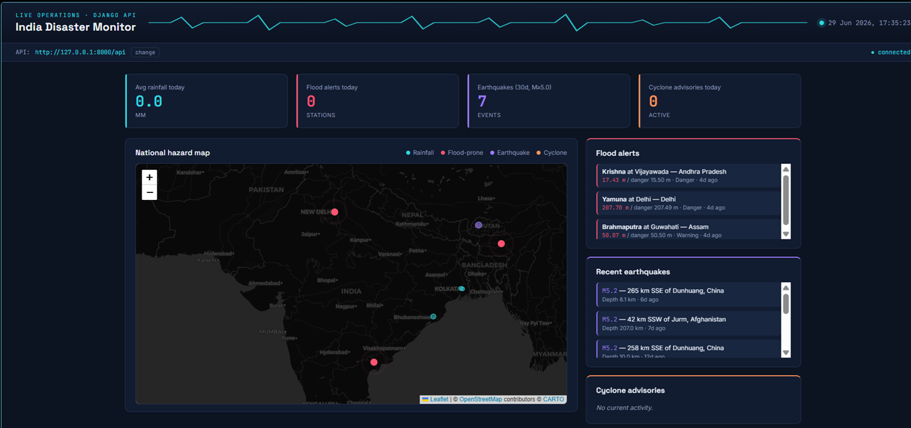

# India Disaster Monitoring System

A full-stack disaster monitoring platform for India covering rainfall,
river floods, earthquakes, and cyclones, built across three connected
components: a Python data-collection backend, a Django REST API, and a
standalone JS dashboard.

## What it does

| Hazard | Source | Behaviour |
|---|---|---|
| Rainfall | OpenWeatherMap (live) | Collects rainfall, temperature, humidity for districts across all 36 states/UTs |
| Floods | Simulated CWC-style gauge data | Compares river levels to danger thresholds and raises alerts automatically |
| Earthquakes | USGS (live, public) | Pulls M >= 5.0 events near India from the last 30 days |
| Cyclones | Simulated IMD-style advisories | Seasonal advisory simulation (Apr-Jun, Oct-Dec) |

All of it lands in one MySQL database, gets summarized into a daily
report, and is exposed two ways: a Flask dashboard with a live map, and a
separate Django REST API plus standalone frontend.

## Components

| Folder | What it is | Tech |
|---|---|---|
| india-disaster-monitoring/ | Data collection engine + its own Flask dashboard | Python, MySQL, requests, pandas, Flask |
| disaster-api-django/ | Read-only REST API over the same database | Django, Django REST Framework |
| disaster-ui/ | Standalone frontend consuming the Django API | HTML, CSS, vanilla JS, Leaflet, Chart.js |

Each folder has its own README with detailed setup steps.

## Features

- Rainfall, temperature, humidity, lat/lon for districts across all states/UTs
- Automatic flood alerts when river levels cross warning/danger thresholds
- Real earthquake feed (USGS), filtered to M >= 5.0, last 30 days
- Cyclone advisory tracking
- 9-table relational schema (states, districts, rainfall, rivers, water levels, flood alerts, earthquakes, cyclone alerts, daily reports)
- Daily automated reports (scheduler.py / cron / Task Scheduler)
- Two independent live dashboards: a server-rendered Flask UI and a separate Django-API-backed JS frontend
- Centralized logging and exception handling throughout
- SQL analysis queries: highest-rainfall states, districts under flood alert, recent earthquakes, 30-day rainfall trends

## Quick start

1. Set up MySQL and the data collector -- see india-disaster-monitoring/README.md
2. Stand up the REST API (reads the same DB) -- see disaster-api-django/README.md
3. Run the standalone dashboard -- see disaster-ui/README.md

## Honest note on data sources

Rainfall (OpenWeatherMap) and earthquakes (USGS) are live, real public
APIs. Flood and cyclone data are simulated around real-world threshold
values, because India's CWC and IMD don't currently expose simple public
REST APIs for this data. Both are built with a drop-in hook
(FLOOD_API_URL / CYCLONE_API_URL) so a real feed can be plugged in later
with no other code changes.

## License

MIT -- see LICENSE.